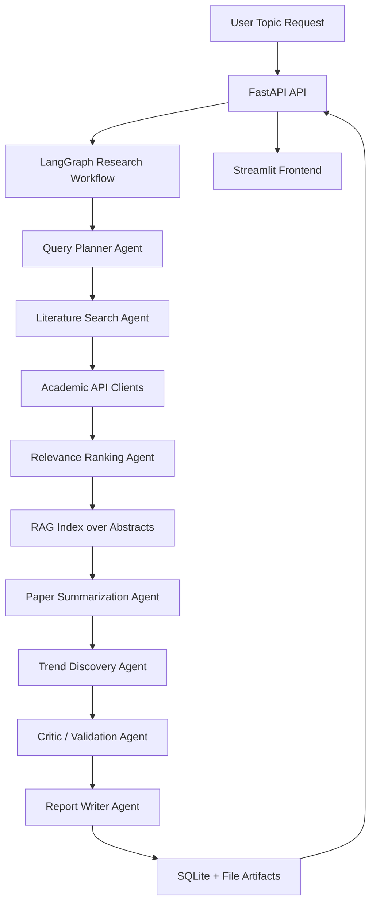

# ScholarTrend AI Architecture

## Flow Summary

1. The user submits a topic and source/time-range preferences.
2. The Query Planner expands the topic into academic search variants and subdomains.
3. The Literature Search Agent queries compliant scholarly APIs asynchronously.
4. The Relevance Ranking Agent deduplicates and ranks papers with a hybrid score.
5. Abstracts are indexed into a vector store to enable RAG-style retrieval over the result set.
6. The Paper Summarization Agent creates grounded per-paper summaries.
7. The Trend Discovery Agent clusters papers into emerging themes.
8. The Critic / Validation Agent flags weak evidence and citation issues.
9. The Report Writer produces a final Markdown and PDF research brief.
